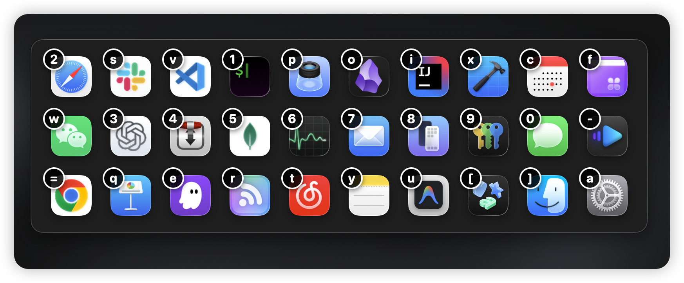
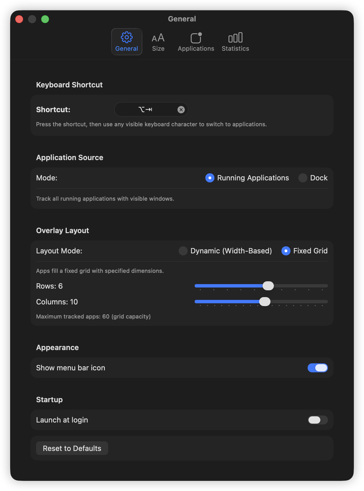
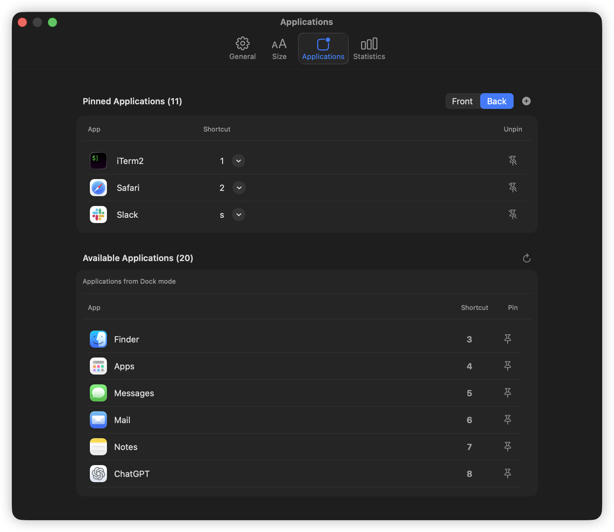
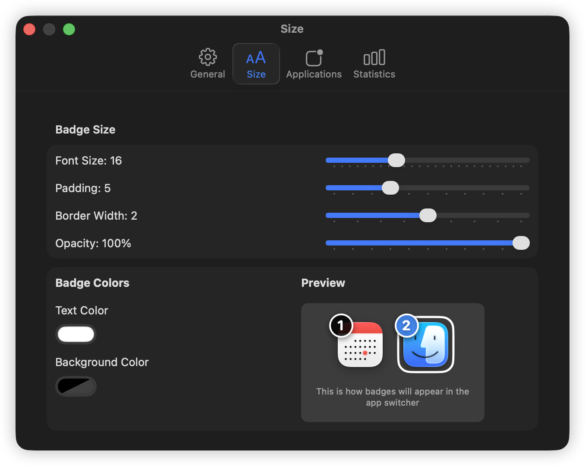
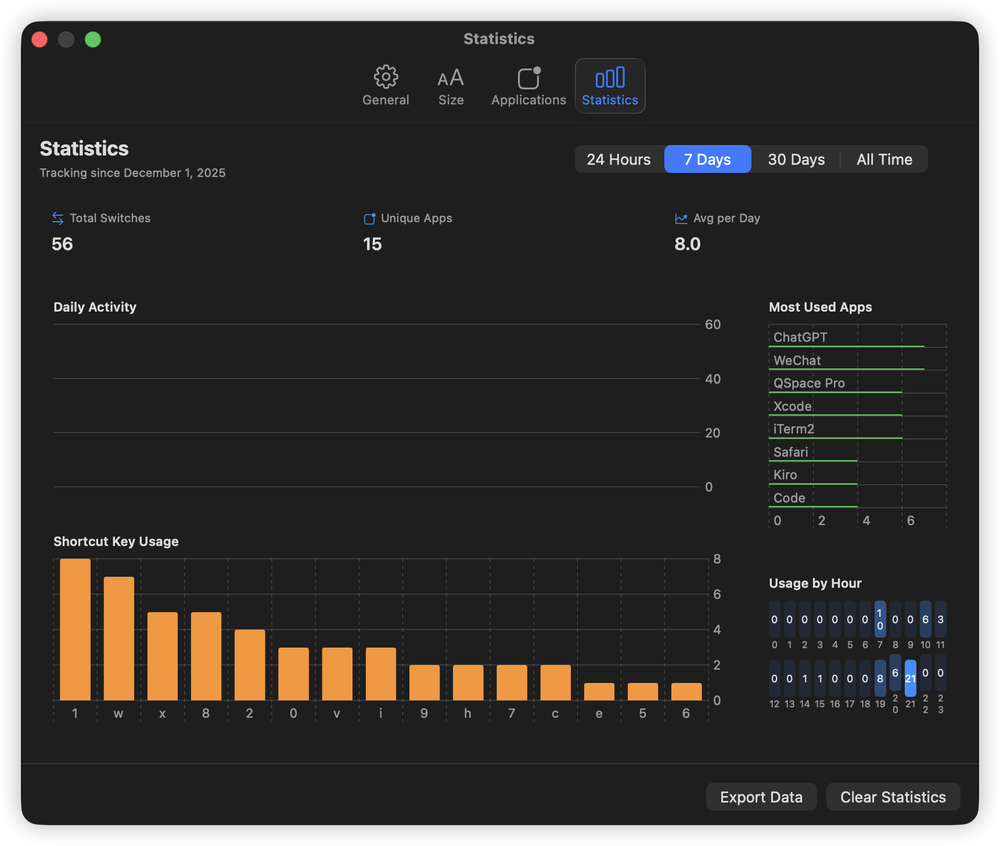

# Mustache 🥸

A fast, keyboard-driven app switcher for macOS that assigns keyboard shortcuts to your running applications.



## Features

- **Keyboard-First Navigation**: Switch between apps using customizable keyboard shortcuts
- **Visual Overlay**: See all your tracked applications with their assigned shortcuts in a clean overlay
- **Flexible App Sources**: Choose between running applications or dock applications
- **Pinned Applications**: Pin your most-used apps with custom shortcuts that persist
- **Customizable Layouts**: Dynamic width-based or fixed grid layouts
- **Badge Customization**: Personalize badge appearance with custom colors, sizes, and styles
- **Usage Statistics**: Track your app switching patterns and most-used shortcuts
- **Launch at Login**: Optionally start Mustache automatically when you log in

## Installation

1. Clone this repository
2. Open `Mustache.xcodeproj` in Xcode
3. Build and run the project
4. Grant accessibility permissions when prompted

## Usage

### Basic App Switching

1. Press your configured hotkey (default: `⌥ + Tab`) to show the app switcher overlay
2. While holding the modifier key, press the number/letter shown on an app to switch to it
3. Release the modifier key to hide the overlay

### Pinning Applications

Pin your favorite apps to ensure they always have the same shortcut:

1. Open Mustache preferences
2. Go to the Applications tab
3. Add apps to your pinned list and assign custom shortcuts
4. Pinned apps are prioritized and will always appear when there are available slots

## Configuration

### General Settings



- **Launch at Login**: Start Mustache automatically
- **Show Menu Bar Icon**: Display status in the menu bar
- **Application Source**: Choose between running apps or dock apps
- **Max Tracked Applications**: Limit the number of apps shown (1-47)

### Application Management



- Pin frequently-used applications
- Assign custom keyboard shortcuts
- Exclude specific applications from tracking
- Configure whether pinned apps appear at the front or back of the list
- Pinned apps always take priority in filling available slots

### Layout & Size



- **Layout Mode**: Dynamic (width-based) or Fixed Grid
- **Grid Configuration**: Set rows and columns for grid layout
- **Badge Style**: Customize colors, size, opacity, and corner radius

### Statistics



Track your app switching behavior:
- Most frequently switched applications
- Most used keyboard shortcuts
- Total switch count

## Requirements

- macOS 15.0 or later
- Accessibility permissions (required for keyboard monitoring)

## Permissions

Mustache requires accessibility permissions to:
- Monitor keyboard shortcuts globally
- Switch between applications
- Track active applications

You'll be prompted to grant these permissions on first launch.

## Development

### Project Structure

```
Mustache/
├── Coordinators/       # Application coordination logic
├── Models/            # Data models and preferences
├── Monitors/          # Application and accessibility monitoring
├── Preferences/       # Settings UI and management
├── Rendering/         # Badge and overlay rendering
└── Hotkeys/          # Keyboard shortcut handling
```

### Building

```bash
open Mustache.xcodeproj
```

### Testing

The project includes comprehensive tests:
- Unit tests for core logic
- UI tests for preferences
- Edge case and permission flow tests

Run tests in Xcode with `⌘ + U` or via the test navigator.

## License

[Add your license here]

## Contributing

Contributions are welcome! Please feel free to submit a Pull Request.
